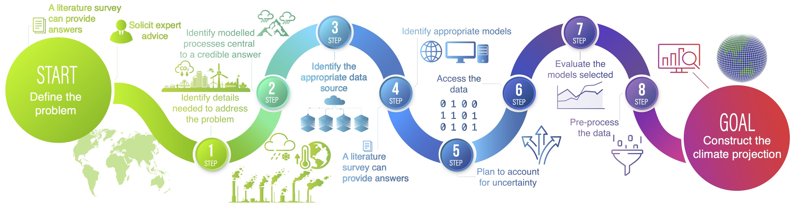

A Non-experts Guide to Understanding Global Climate Models

*Demystifying global climate models for use in the life sciences* serves as a comprehensive guide for using climate model outputs. The goal of the paper is to make the process of using these models more explicit and to place decisions regarding potential trade-offs in the hands of the user. Schoeman emphasizes the importance of cross-disciplinary collaboration between life scientists and expert users of Earth system models to develop robust evidence necessary to address the challenges posed by climate change to human and natural systems.

In the realm of climate science, global climate models are indispensable tools. They provide us with a glimpse into potential future climates, helping us prepare for various scenarios. Contrary to popular belief, these models are not designed to predict the future with pinpoint accuracy. Instead, they estimate a range of possible climate futures based on various plausible scenarios. These scenarios consider factors like greenhouse gas emissions, aerosol levels, and land-use changes, all of which are tied to different socioeconomic pathways.

Schoeman emphasizes the importance of understanding the uncertainties associated with these models. These uncertainties arise from the models' structure, alternative emission scenarios, and the inherent variability in climate simulations. To account for these uncertainties, scientists often use multimodel ensembles, which provide a range of projections from a diverse set of models.

The article also highlights the need for careful evaluation of the models used. While climate models are continually improving, it's crucial to assess their performance based on the features of the chosen variables that are important for the problem at hand. This could include mean state, seasonal cycle, interannual variability, or long-term trends.

In conclusion, Schoeman's article serves as a valuable guide for anyone looking to understand the complex world of global climate models. By shedding light on their workings, uncertainties, and evaluation, he helps us appreciate their role in our fight against climate change.
